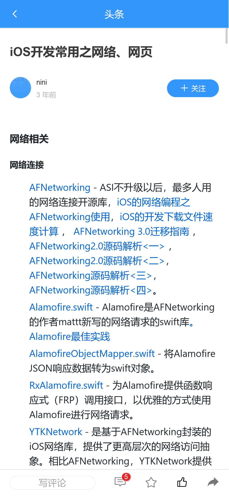

# toutiao-m

参考：https://github.com/lipengzhou/toutiao-m


## 项目初始化

```
npm install
```

## 项目运行

```
npm run serve
```

## 项目编译

```
npm run build
```

## Screenshot

#### 首页


#### 文章



#### 用户页面


